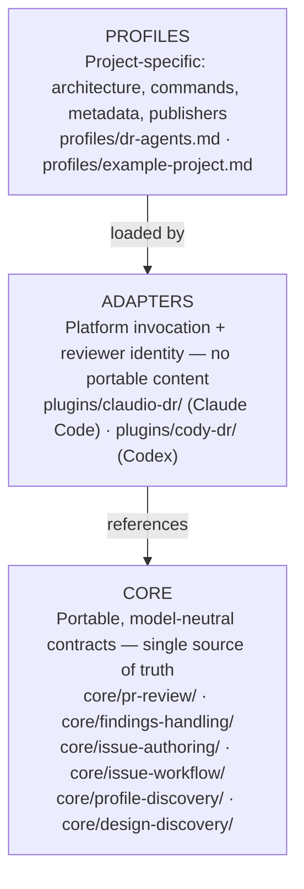
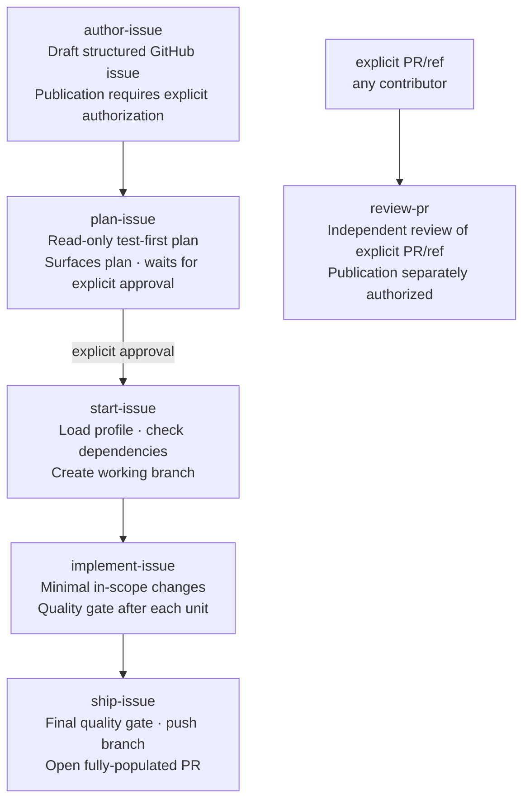

<p align="center">
  
</p>

dr-agents is a shared workflow catalog for design discovery, pull-request
review, finding triage, issue authoring, and the full issue-to-change lifecycle.
Its portable contracts live in `core/`, with thin adapters for Claude Code and
Codex and optional per-project profiles.

## Why it exists

AI-assisted code review and issue execution tend to be tied to a single model
or platform. When the model changes, or when a team uses more than one, the
behavior diverges, the prompts drift, and the review quality becomes
inconsistent.

This catalog solves that by separating **what** the agent does (the portable
contract in `core/`) from **how** it does it on a specific platform (the thin
adapter in `plugins/`) and **what rules apply to a specific project** (the
profile). The result is reproducible, auditable agent behavior that travels
with the team, not with the tool.

Design principles:

- **Portable first.** Core contracts are model-neutral — the same logic runs on
  Claude Code and Codex.
- **Profile-driven.** Project rules (commands, labels, branch policy,
  publishers) live in the consuming repository, not in the shared catalog.
- **Explicit publication.** No agent action publishes without an explicit
  request. Branch creation, commits, push, and PR opening are authorized by
  issue execution; reviews, comments, and thread resolution are each separately
  authorized.
- **No secrets in the catalog.** Publisher configuration references secret
  names only; values never appear in any tracked file.

## Architecture overview

The catalog has three independent layers. Each layer has a single
responsibility. No layer reaches into the one above it.



Read [docs/architecture.md](docs/architecture.md) for the full layer diagram
and data flow.

## How it works in practice

A typical issue-to-PR cycle with Claudio DR looks like this:



The same lifecycle runs identically on Codex with Cody DR — same contracts,
same quality gate, same output format, different platform invocation. PR review
is a separate, explicit-reference workflow and can review a PR from any
contributor.

## Available skills

| Skill | What it does |
| --- | --- |
| `review-pr` | Evidence-first PR review with incremental re-review |
| `handle-pr-findings` | Triage, fix, defer, or reject findings against the current head |
| `author-issue` | Draft and optionally publish a structured GitHub issue; performs mode-detection and profile-discovery to select the correct publisher |
| `design-discovery` | Produce an evidence-grounded UX/UI Design Brief and implementation handoff |
| `design-and-author` | Chain design discovery into issue authoring in a single invocation |
| `clarify-spec` | Surface material spec decisions and explicit defaults without writing |
| `analyze-spec` | Report spec coverage, conflicts, boundaries, and checkpoint readiness |
| `classify-spec-drift` | Classify code/spec drift and recommend the smallest authorized next action |
| `plan-issue` | Surface a read-only, test-first implementation plan and wait for explicit approval before any file is touched |
| `start-issue` | Load a profile and issue, check dependencies, create working branch |
| `execute-issue` | Orchestrate the full lifecycle (plan → start → implement → ship) with a single human gate after plan approval |
| `ship-issue` | Run final quality gate, push branch, and open fully-populated PR (no extra approval gate when reached via execute-issue) |
| `plan-implementation` | _(internal)_ Read-only plan step used within execute-issue |
| `implement-issue` | _(internal)_ In-scope implementation step used within execute-issue |
| `ship-change` | _(legacy internal)_ Superseded by formal `ship-issue` delivery |

## Installation

### Bootstrap (first-time setup)

Clone the repo and run the installer directly from the catalog:

```bash
git clone https://github.com/dgaramos/dr-agents.git ~/dr-agents
~/dr-agents/bin/install --global
```

`bin/install --global` installs:

- claudio-dr plugin to `~/.claude/`
- cody-dr plugin to `~/.codex/`
- `agents` CLI to `~/.local/bin/agents`

After this, the `agents` command is available system-wide — no direnv or
catalog directory in `PATH` required. Ensure `~/.local/bin` is in your `PATH`
(it usually is on macOS and most Linux distributions).

### Using the agents entrypoint

Once installed, use `agents` for all operations from any directory:

```bash
agents install --global              # install claudio-dr, cody-dr, and agents CLI globally
agents install --workflows           # install publisher dispatch stubs only (no adapter plugins)
agents install --repo                # install claudio-dr into the current repo
agents install --repo --profile <name>  # with a project-specific profile
agents download                      # download from GitHub releases and install globally (no git required)
agents download --version v1.2.3     # pin to a specific release tag
agents status                        # show installed versions and locations
agents update --global               # pull catalog and update global install
agents update --repo [--profile <name>]  # pull and update repo-local install
agents update --download             # update a download-based install to the latest release
agents update --all                  # pull and update both installs
```

The install scripts detect conflicts and never silently overwrite an existing
file whose content differs from the source.

### External SDD specs

Spec-Driven Development can use an external, private specs repository only
when the target project's `PROFILE.md` declares its exact trio path. Configure
the repository identity in the environment before starting Codex or Claude:

```bash
export SPECS_REPOSITORY="owner/private-specs"
```

This sets it for the current terminal session. To persist it, add the same
`export` line to the startup file for the shell you use, then open a new
terminal:

```bash
# zsh (macOS default and many Linux setups)
printf '\nexport SPECS_REPOSITORY="owner/private-specs"\n' >> ~/.zshrc

# bash (choose the startup file your system loads, commonly ~/.bashrc)
printf '\nexport SPECS_REPOSITORY="owner/private-specs"\n' >> ~/.bashrc
```

Start Codex or Claude from that new terminal so it inherits the variable.
`SPECS_REPOSITORY` is intentionally not stored in the catalog or profile as a
literal value. If the variable is missing, empty, or invalid, the agent stops
instead of guessing a repository. The profile still controls the authorized
path and external writes always require a separate explicit request.

#### Read-only SDD workflow

An authorized spec starts as the portable trio `requirements.md`, `design.md`,
and `tasks.md`. A source can also contain optional `spec.yaml` lifecycle
metadata with `draft`, `review`, `accepted`, or `superseded` status. A project
profile may require `accepted` status before issue authoring or execution; a
missing, draft, review, or superseded spec then produces a handoff instead of
being treated as current.

Use `clarify-spec` to surface material decisions and explicit proposed defaults
without writing them. Use `analyze-spec` to report criterion and verification
coverage, cross-artifact conflicts, boundaries, and checkpoint readiness. Use
`classify-spec-drift` when implementation diverges from a spec: it reports
`code-wrong`, `spec-incomplete-or-wrong`, or `implementation-only` and names
the smallest permitted next action.

All three workflows are advisory and read-only. They never infer a source or
status, execute task verification commands, rewrite a spec, change code, or
publish an issue or pull request. Those actions retain their own explicit
authorization boundaries.

### Tarball install (no git required)

Download and install directly from a GitHub release without cloning the
repository. This is the recommended method for machines where git is
unavailable or where you want a pinned, immutable version:

```bash
# Install the latest release
bin/install --download

# Install a specific version
bin/install --download --version v1.2.3
```

The tarball is downloaded from GitHub releases, its SHA-256 checksum is
verified, and the catalog is extracted to
`~/.local/share/dr-agents/<version>/`. The `agents` CLI wrapper is
written to `~/.local/bin/agents`. Previous version directories are preserved
for manual rollback.

To update a download-based install to the latest release:

```bash
agents update --download
```

`bin/check` handles the non-git context gracefully when run from an extracted
tarball — git-specific checks are skipped automatically.

### direnv (optional, for catalog development)

This repo ships a `.envrc` that adds `bin/` to your `PATH` automatically via
[direnv](https://direnv.net/), which is useful when working on the catalog
itself. If you have direnv installed, run `direnv allow` once after cloning.

### Claude Code (Claudio DR)

```text
/plugin marketplace add dgaramos/dr-agents
/plugin install claudio-dr@dr-agents
```

Invoke a skill or use a workflow agent:

```text
/claudio-dr:execute-issue #42
/claudio-dr:review-pr <PR URL>
/claudio-dr:review-pr <PR URL> using a profile from the target repository
/claudio-dr:author-issue <structured request>
/claudio-dr:design-discovery <UX/UI request or reference>
/claudio-dr:design-and-author <UX/UI request or reference>
```

See [docs/claudio-dr.md](docs/claudio-dr.md) for the full installation,
update, and local validation flow.

### Codex (Cody DR)

```bash
codex plugin marketplace add /path/to/dr-agents
codex plugin add cody-dr@dr-agents
```

Invoke a workflow agent or skill:

```text
@cody-executor execute issue #42
@cody-reviewer review <PR URL>
@cody-executor plan issue #42
@cody-author draft issue
@cody-designer assess this checkout flow
@cody-designer design-and-author <UX/UI request or reference>
@cody-helper explain how to use Cody DR in this repository
```

See [docs/cody-dr.md](docs/cody-dr.md) for the full installation and local
validation flow.

### Adding a profile to a target project

Drop a profile into the target repository:

```text
<target-repo>/.dr-agents/<name>/PROFILE.md
```

Use `profiles/example-project.md` in the catalog as the starting template; the deployed profile lives in the consuming repository under `.dr-agents/<name>/PROFILE.md`. A profile defines
architecture boundaries, the quality command, PR metadata (labels, milestone,
assignees, Project), and publisher workflow names. It cannot weaken the core
evidence threshold or the explicit-publication boundary.

## Repository structure

```text
core/                    Portable contracts — never touch target-project specifics here
plugins/claudio-dr/      Claude Code adapter — identity and platform mechanics only
plugins/cody-dr/         Codex adapter — identity and platform mechanics only
profiles/                Project profiles — architecture, commands, metadata, publishers
examples/                One generic example per core skill area
docs/                    Compatibility, installation, development docs
bin/agents               Unified CLI entrypoint (install / update / status)
bin/check                Catalog quality gate — run before every handoff; skips git checks when run outside a git repository (e.g. from an extracted tarball)
bin/drift                Profile-drift detector — checks profiles against current core contracts
bin/install              Install plugins globally or into a repo; detects conflicts; --download installs from GitHub releases without cloning
bin/update               Pull the catalog and re-run bin/install for active installs; --download updates a tarball-based install
.envrc                   Adds bin/ to PATH via direnv so `agents` works without prefix
.github/workflows/release.yml  Automated release workflow — builds and publishes a versioned tarball and SHA-256 checksum to GitHub releases on each tag push
```

## Status and roadmap

Current milestone: **3** · [Project board](https://github.com/users/dgaramos/projects/11)

What is in place:

- Full PR review and findings-handling contracts (Claudio DR + Cody DR)
- Full issue lifecycle (plan-issue → start-issue → execute-issue → ship-issue) with a single human gate after plan approval — implement, push, and PR proceed without interruption
- Issue authoring with mode-detection, profile-discovery, and optional bot publication
- Contribution guidance discovery in start-issue and implement-issue
- Designer agents (`claudio-designer`, `cody-designer`) for evidence-grounded UX/UI design discovery
- Profile discovery and loading
- Self-profile for this repository
- Publisher workflows for review, reply, thread resolution, PR metadata, and
  issue creation (both apps)
- Quality gate (`bin/check`) with path, frontmatter, parity, and drift checks
- Installation tooling (`bin/install`, `bin/update`) with `agents install --workflows` for workflow-only deploys
- Plan surfacing via `SendMessage` so plans appear in the main conversation before implementation begins
- Automated profile-drift detection (`bin/drift`) for profiles that reference removed core contracts
- End-to-end examples covering design-discovery → author-issue → execute-issue chains (`examples/generic-chain-design-to-issue.md`)
- Automated release workflow (`release.yml`) that builds and publishes a versioned tarball with SHA-256 checksum to GitHub releases on each tag push; tarball installs (`bin/install --download`, `agents download`) and updates (`bin/update --download`) are supported without a git clone

What is next:

- Canonical profile templates for web-app, library, and CLI project archetypes

## Contributing

Read [docs/contributing-guide.md](docs/contributing-guide.md) for the full
workflow: picking up an issue, branching, implementing with the correct layer
discipline, committing with the `claudio-dr[bot]` trailer, opening a PR using
the template, dispatching the metadata publisher, and requesting an agent
review.

Before every commit or handoff, run:

```bash
bin/check
```

## Development

Read [docs/architecture.md](docs/architecture.md),
[docs/compatibility.md](docs/compatibility.md), and
[docs/development.md](docs/development.md). GitHub Actions runs the same
`quality` check on every PR and push to `main`.
