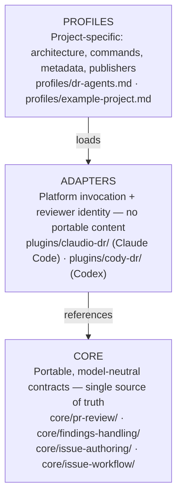
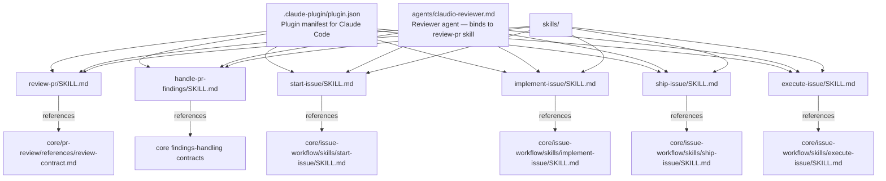
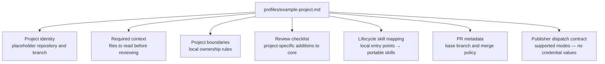
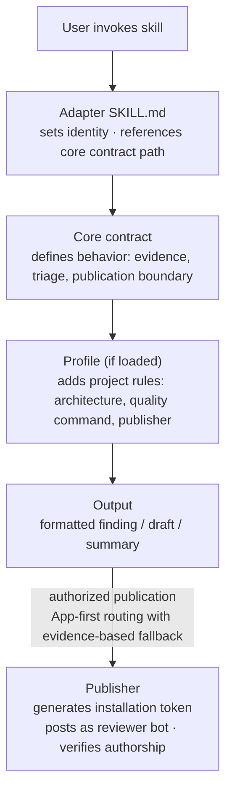

# Architecture

## Overview

The catalog is organized in three independent layers. Each layer has a single
responsibility and a strict boundary — no layer reaches into the one above it.

## Layers in detail

### Core

Contains portable contracts only. Every contract defines inputs, steps, output
format, and the publication boundary. No core file contains repository-specific
commands, branch names, credentials, labels, or remote references.

| Area | Contracts | Skills |
| --- | --- | --- |
| `core/pr-review/` | `review-contract.md`, `profile-contract.md`, `reporting.md` | — (consumed directly) |
| `core/findings-handling/` | `findings-contract.md` | `handle-findings` |
| `core/issue-authoring/` | `issue-contract.md` | `author-issue` |
| `core/design-discovery/` | `design-discovery-contract.md` | `design-discovery` |
| `core/issue-workflow/` | `workflow-contract.md`, `start-issue-contract.md`, `plan-implementation-contract.md`, `implement-issue-contract.md`, `ship-issue-contract.md`, `execute-issue-contract.md` | `start-issue`, `plan-implementation`, `implement-issue`, `ship-issue`, `execute-issue` |

### Adapters

Each adapter is a thin wrapper that contributes exactly two things:

1. **Reviewer identity** — the name used in summaries and publication fields
   (Claudio DR or Cody DR).
2. **Platform mechanics** — how to invoke the publisher, which CLI tools to use,
   and any platform-specific invocation differences documented in
   `docs/compatibility.md`.

Adapter SKILL.md files reference the corresponding core contract by path. They
must not embed finding tables, confidence thresholds, or summary templates.
Each installable plugin also contains a generated `core/` bundle at its root:
marketplace runtimes install one plugin directory, not the catalog's sibling
`core/` directory. The catalog `core/` remains the only editable source; CI
rejects a bundled file that differs from it.

`plugins/cody-dr/` mirrors this structure for Codex. Intentional platform
differences are documented in `docs/compatibility.md`.

### Profiles

A profile is a project-specific configuration file loaded at runtime. It
strengthens the core — adding architecture rules, required files, quality
commands, PR metadata, and publisher dispatch — but cannot weaken the evidence
threshold or the explicit-publication boundary.

Consumer profiles are target-owned: they live in the consumer repository, not
in this catalog. The catalog keeps only its self-profile and a neutral example
that demonstrates the required shape without naming a target.

## Data flow

## Publication model

Every external action follows the same three-step gate:

1. **Authorization** — an explicit issue-execution request authorizes its
   branch, commits, push, and PR. Review, reply, resolution, and issue creation
   each remain separately authorized.
2. **Publisher** — discover the App publisher using profile guidance and adapter
   workflow paths. Prefer the App; personal fallback requires proven
   unavailability, not merely a missing profile or a lookup error.
3. **Verification** — after every publisher action, the adapter verifies that
   the author, event, and target match the selected App or personal actor.

The personal `gh` session dispatches an available App publisher, or publishes
as the verified personal actor on an evidenced fallback. It never impersonates
the App. See the [routing contract](../core/pr-review/references/publication-routing-contract.md).

For a repository-neutral walkthrough of `start-issue`, `implement-issue`, and
`ship-issue`, including dependency and quality-gate handoffs, see the
[generic issue-to-change lifecycle](../examples/generic-issue-lifecycle.md).

## Validation

`bin/check` enforces the layer boundaries at commit time:

- **Required paths**: every core contract, adapter skill, and profile must exist.
- **SKILL.md frontmatter**: all skills must have a valid `description` field.
- **Adapter drift**: adapter review-pr skills must reference the core contract
  and must not embed the finding class table or confidence threshold.
- **Parity**: both adapter reviewer agents must bind to `review-pr`; both sets
  of workflow adapter skills must reference their corresponding core skills.
- **Public surface**: every README-announced skill must exist in both adapters,
  manifests must be valid and version-aligned, and consumer profiles must stay
  out of the catalog.
- **Examples**: review, findings, issue authoring, design discovery, and lifecycle contracts each
  have a generic, repository-neutral example.
- **Core bundles**: each plugin's generated `core/` distribution bundle must
  exactly match the canonical `core/`; ad-hoc copies inside adapter skills are
  forbidden.
- **Secrets**: tracked files matching credential-like patterns fail the check.
